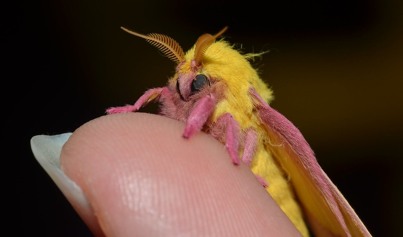

# nanograd
An cute little implementation of reverse mode auto-differentiation in ~40 lines of python.

May be useful for educational purposes. 


<small>Image by [Andy Reago & Chrissy McClarren](https://www.flickr.com/photos/wildreturn/20309009618/in/photostream/) - [CC BY 2.0](https://creativecommons.org/licenses/by/2.0/)</small>

#### Example
```python
from nanograd import Var

a = Var(3.0)
b = Var(5.0)
c = Var(9.0)
d = b * c
e = a + (-d) ** 2
f = (e / d).relu()
f.backward()

for v in [a, b, c, d, e, f]:
    print(v)
```
Outputs 
```
Var(v=3.0000, grad=0.0222)
Var(v=5.0000, grad=8.9867)
Var(v=9.0000, grad=4.9926)
Var(v=45.0000, grad=0.9985)
Var(v=2028.0000, grad=0.0222)
Var(v=45.0667, grad=1.0000)
```

#### Running tests
The tests use pytorch to check the gradients.

`python -m pytest`

